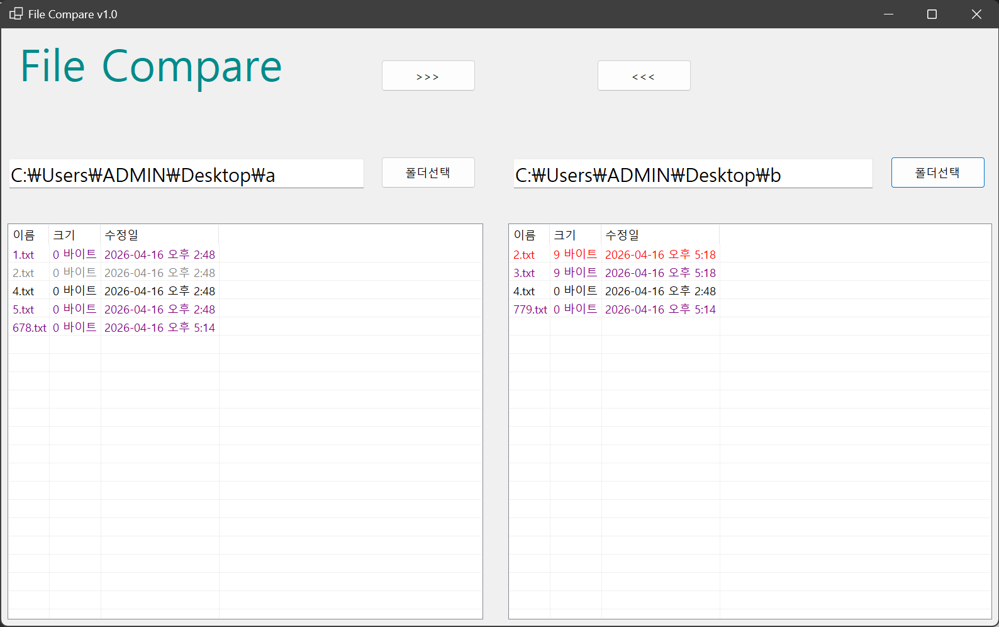
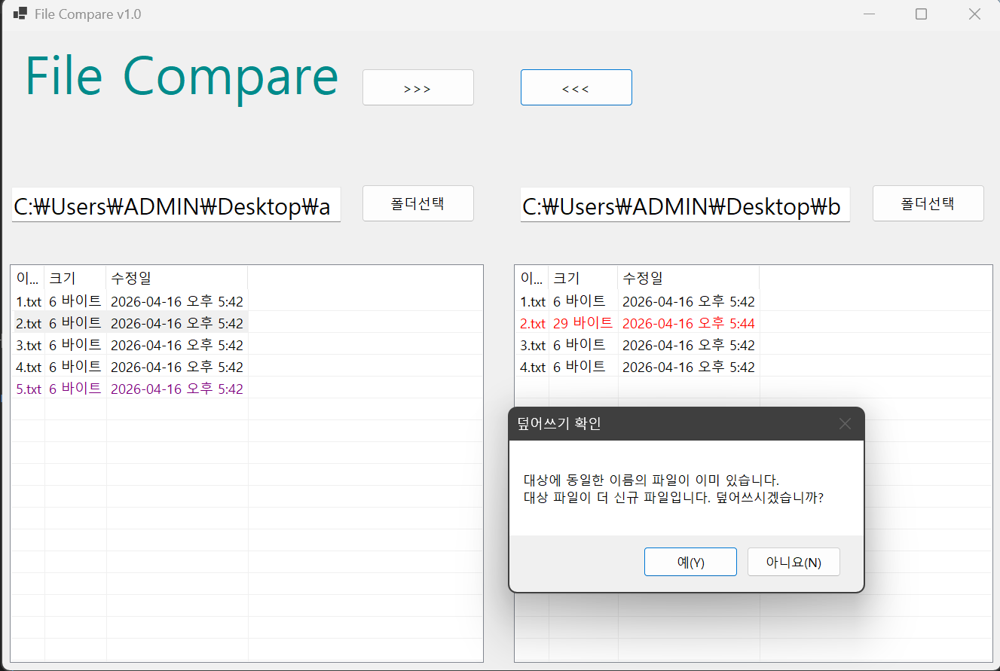

# (C# 코딩) FileCompare

## 개요
- **목적**: 두 폴더의 파일들을 비교하고 상호 복사하여 최신 버전을 관리하는 툴 구현
- **사용 플랫폼**: C#, .NET Windows Forms, Visual Studio, GitHub
- **주요 컨트롤**: SplitContainer, Panel, Label, TextBox, Button, ListView

## 실행 화면 (과제1)
- **구현 내용**: 기본 UI 배치 및 컨트롤 명명 완료
- 
- **상세 내용**:
    - SplitContainer와 6개의 Panel을 이용한 구조적 UI 설계
    - ListView 속성 설정: View.Details, FullRowSelect, GridLines 적용
    - 각 컨트롤에 고유 변수명 부여 (btnLeftDir, lvwLeftDir 등)

## 실행 화면 (과제2)
- **구현 내용**: 폴더 선택 기능 및 파일 비교 결과 색상 표시
- 
- **상세 내용**:
    - FolderBrowserDialog를 통해 사용자가 원하는 경로를 선택하고 해당 경로를 텍스트박스에 출력
    - ListView 상세 보기 모드에서 파일명, 크기, 마지막 수정 시간을 리스트업
    - 파일 비교 로직: 양쪽 리스트의 파일명을 대조하여 최신 버전과 단독 존재 파일 판별
    - 색상 가이드 적용: 최신 파일(Red), 오래된 파일(Gray), 단독 존재 파일(Purple)로 시각화

## 실행 화면 (과제3)
- **구현 내용**: 파일 복사 및 덮어쓰기 확인 로직 구현
- 
- **상세 설명**: 복사 대상이 더 최신일 경우 사용자 확인 후 복사 진행 (File.Copy 활용)

## 실행 화면 (과제4)
(과제 완료 후 스크린샷과 설명 추가 예정)