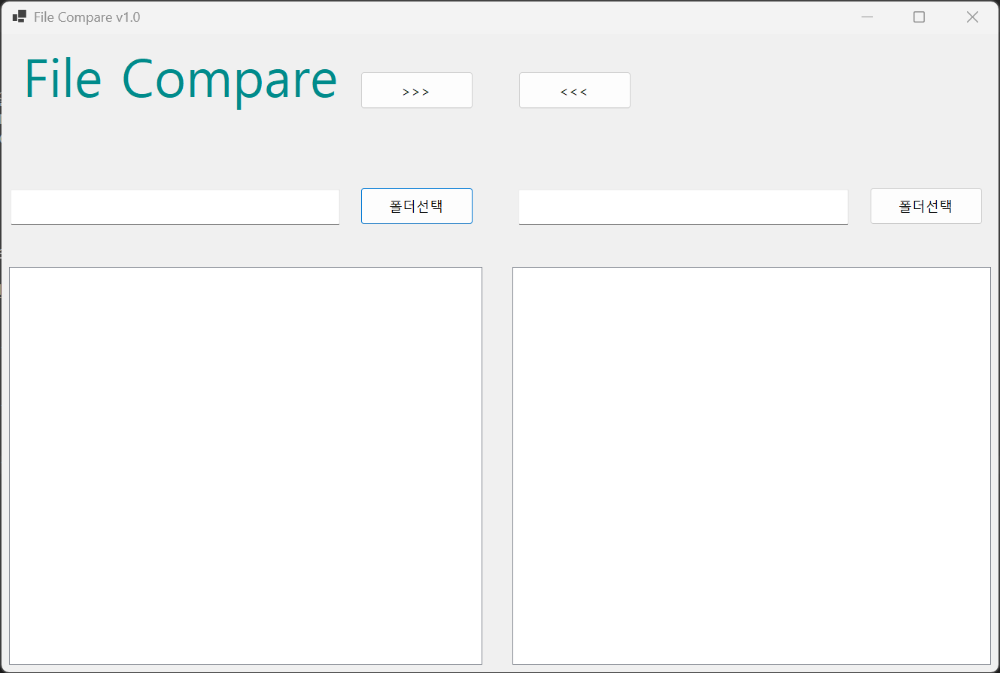

# (C# 코딩) FileCompare

## 개요
- **목적**: 두 폴더의 파일들을 비교하고 상호 복사하여 최신 버전을 관리하는 툴 구현
- **사용 플랫폼**: C#, .NET Windows Forms, Visual Studio, GitHub
- **주요 컨트롤**: SplitContainer, Panel, Label, TextBox, Button, ListView

## 실행 화면 (과제1)
- **구현 내용**: 기본 UI 배치 및 컨트롤 명명 완료
- 
- **상세 내용**:
    - SplitContainer와 6개의 Panel을 이용한 구조적 UI 설계
    - ListView 속성 설정: View.Details, FullRowSelect, GridLines 적용
    - 각 컨트롤에 고유 변수명 부여 (btnLeftDir, lvwLeftDir 등)

## 실행 화면 (과제2)
(과제 완료 후 스크린샷과 설명 추가 예정)

## 실행 화면 (과제3)
(과제 완료 후 스크린샷과 설명 추가 예정)

## 실행 화면 (과제4)
(과제 완료 후 스크린샷과 설명 추가 예정)